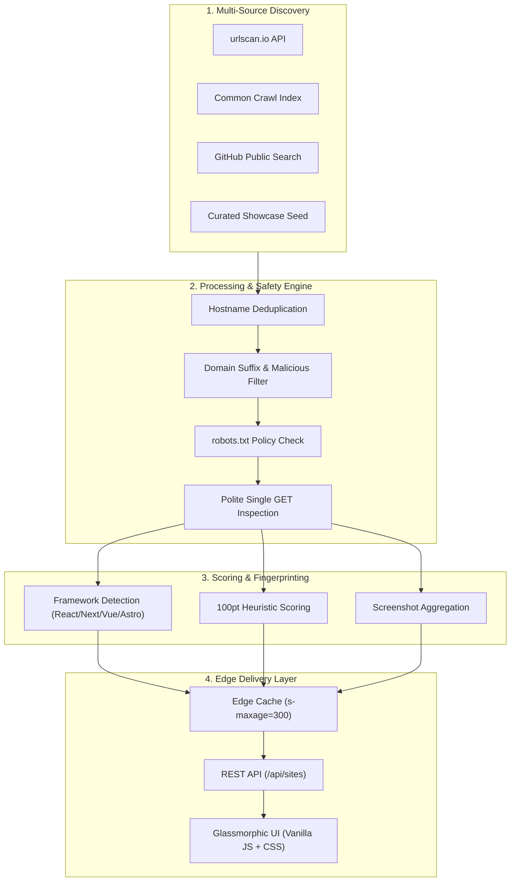

> [!NOTE]
> **Live Web Directory:** SiteScout is live and deployed at **[https://sitescout-app.vercel.app](https://sitescout-app.vercel.app)** — indexing real-time public web applications across 12+ cloud platforms with zero database overhead.

<div align="center">

# 🛰️ SiteScout

### Autonomous, stateless visual radar & directory for publicly discoverable web apps.

[](https://github.com/jojin1709)
[](https://github.com/sponsors/jojin1709)
[](https://github.com/jojin1709/SiteScout/actions/workflows/ci.yml)
[](https://github.com/jojin1709/SiteScout/actions/workflows/security.yml)
[](LICENSE)
[](https://vercel.com)
[](package.json)

<p>
  <strong>SiteScout</strong> discovers, audits, scores, and visualizes live web applications deployed on free and test hosting domains like <code>vercel.app</code>, <code>pages.dev</code>, <code>netlify.app</code>, <code>github.io</code>, <code>onrender.com</code>, <code>fly.dev</code>, and <code>railway.app</code>.
</p>

```bash
# Clone & explore locally in seconds
git clone https://github.com/jojin1709/SiteScout.git
cd SiteScout
npm run check && npm run smoke
```

---

<a href="https://sitescout-app.vercel.app"><strong>Explore Live Directory ↗</strong></a>&nbsp;&nbsp;&nbsp;&nbsp;&nbsp;&nbsp;<a href="https://github.com/sponsors/jojin1709"><strong>Sponsor Project 💖</strong></a>&nbsp;&nbsp;&nbsp;&nbsp;&nbsp;&nbsp;<a href="https://github.com/jojin1709/SiteScout/issues"><strong>Report Issue / Request Source ↗</strong></a>

---

</div>

> [!TIP]
> **100% Stateless by Design:** SiteScout operates without a central database. Feeds are generated from multi-source adapters, analyzed at runtime, and cached on the edge (5-minute `s-maxage`) for instantaneous global delivery.

---

## Table of Contents

- [What is SiteScout?](#what-is-sitescout)
  - [Why SiteScout Exists](#why-sitescout-exists)
  - [Key Architecture Principles](#key-architecture-principles)
- [Architecture & Engine Workflow](#architecture--engine-workflow)
- [Supported Hosting Platforms](#supported-hosting-platforms)
- [Automated 100-Point Scoring Engine](#automated-100-point-scoring-engine)
- [Quick Start](#quick-start)
  - [Prerequisites](#prerequisites)
  - [Local Setup](#local-setup)
- [Deployment](#deployment)
  - [Deploy to Vercel (Recommended)](#deploy-to-vercel-recommended)
  - [Deploy to Cloudflare Pages + Scheduled Worker](#deploy-to-cloudflare-pages--scheduled-worker)
- [API Reference](#api-reference)
- [Configuration & Environment Variables](#configuration--environment-variables)
- [Security & Safe Crawling Model](#security--safe-crawling-model)
- [Project Layout](#project-layout)
- [Developer & Sponsorship](#developer--sponsorship)
- [Common Questions (FAQ)](#common-questions-faq)
- [License](#license)

---

## What is SiteScout?

Thousands of developers deploy indie projects, open-source demos, AI utilities, and portfolio experiments to subdomains on free cloud platforms daily. Most of these projects never get indexed by traditional search engines and remain hidden.

**SiteScout** is a lightweight, screenshot-first directory that surfaces these applications through safe public discovery, automated Lighthouse-style technical scoring, and framework fingerprinting.

<details>
<summary><strong>Why SiteScout Exists</strong></summary>

Traditional search engines index for commercial SEO, favoring large websites with backlinks. Developers looking for inspiration, indie hackers discovering new tools, or security engineers exploring public subdomains had no dedicated visual radar. 

SiteScout acts as a public discovery layer tailored specifically for subdomains on modern cloud providers.
</details>

<details>
<summary><strong>Key Architecture Principles</strong></summary>

- **No Database Lock-in:** No SQL, NoSQL, or external state stores. It runs effortlessly in serverless memory.
- **Strictly Polite Crawling:** Always checks `robots.txt`, respects 7-second fetch limits, never follows cross-origin redirect traps, and makes at most one homepage request per candidate.
- **Privacy & Simplicity:** No user accounts, tracking cookies, login forms, or user data storage.
- **Dual-Runtime Support:** Codebase runs identically on **Vercel Serverless Functions** (Node.js) and **Cloudflare Pages/Workers** (V8 isolate Edge).
</details>

---

## Architecture & Engine Workflow



---

## Supported Hosting Platforms

SiteScout monitors and categorizes subdomains across 12 primary cloud and hosting providers:

| Platform | Domain Suffixes | Platform Type | Default SSL |
| :--- | :--- | :--- | :--- |
| **▲ Vercel** | `*.vercel.app` | Serverless & Edge Frontend | TLS 1.3 |
| **⚡ Cloudflare Pages** | `*.pages.dev` | Global Edge Network | TLS 1.3 |
| **⛅ Cloudflare Workers** | `*.workers.dev` | Edge Compute Functions | TLS 1.3 |
| **💎 Netlify** | `*.netlify.app` | Jamstack & Serverless | TLS 1.3 |
| **🐙 GitHub Pages** | `*.github.io` | Static Documentation & Sites | TLS 1.3 |
| **🚀 Render** | `*.onrender.com` | Cloud Application Platform | TLS 1.3 |
| **🎈 Fly.io** | `*.fly.dev` | Global Micro-VM Containers | TLS 1.3 |
| **🚂 Railway** | `*.railway.app` | Infrastructure Platform | TLS 1.3 |
| **🔥 Firebase Hosting** | `*.web.app`, `*.firebaseapp.com` | Google Cloud Static & Dynamic | TLS 1.3 |
| **🌊 Surge** | `*.surge.sh` | Static Web Publishing | TLS 1.3 |
| **🟣 Heroku** | `*.herokuapp.com` | Cloud Container Platform | TLS 1.3 |

---

## Automated 100-Point Scoring Engine

Each discovered website receives an objective, automated 0–100 technical rating evaluated across 7 key architectural criteria:

```text
┌─────────────────────────────────────────────────────────────┬──────────┐
│ Metric & Evaluation Signal                                  │ Weight   │
├─────────────────────────────────────────────────────────────┼──────────┤
│ 🔒 HTTPS Enforcement (TLS encrypted connection)             │ 20 pts   │
│ 🌐 HTTP Status OK (200 OK without redirect loops)           │ 20 pts   │
│ ⚡ Fast Response Latency (< 300ms server response)           │ 15 pts   │
│ 🏷️ SEO Metadata (HTML <title> + meta description present)   │ 15 pts   │
│ 🖼️ OpenGraph Social Cards (og:image & rich preview meta)    │ 10 pts   │
│ 📱 Responsive Mobile Viewport (<meta name="viewport">)     │ 10 pts   │
│ 🛡️ Security Headers (CSP, HSTS, X-Content-Type-Options)    │ 10 pts   │
├─────────────────────────────────────────────────────────────┼──────────┤
│ TOTAL TECHNICAL BENCHMARK                                   │ 100 pts  │
└─────────────────────────────────────────────────────────────┴──────────┘
```

---

## Quick Start

### Prerequisites

- **Node.js 20+**
- Git

### Local Setup

```bash
# 1. Clone repository
git clone https://github.com/jojin1709/SiteScout.git
cd SiteScout

# 2. Run integrity and smoke checks
npm run check
npm run smoke

# 3. Start local development server
npm run dev
```

Visit **`http://localhost:4173`** in your browser to inspect the application.

---

## Deployment

### Deploy to Vercel (Recommended)

1. Push or fork this repository to your GitHub account.
2. Open **[Vercel Dashboard](https://vercel.com/new)** and click **Import** for `SiteScout`.
3. In **Environment Variables**, configure:
   - `CRON_SECRET` = `(any secure random string)`
   - `URLSCAN_API_KEY` *(optional, for urlscan.io search)*
   - `GITHUB_TOKEN` *(optional, increases GitHub API rate limit)*
4. Click **Deploy**. Vercel will automatically configure both the static assets in `public/` and the serverless functions in `api/`.

### Deploy to Cloudflare Pages + Scheduled Worker

1. **Deploy Frontend & Pages Functions:**
   Connect the repository to **Cloudflare Pages** with root directory `./`, build output `public`, and discovery from `functions/`.
2. **Deploy Scheduled Collector Worker:**
   ```bash
   npx wrangler login
   npx wrangler deploy
   npx wrangler secret put CRON_SECRET
   ```

---

## API Reference

SiteScout exposes clean, CORS-enabled JSON API endpoints:

| Endpoint | Method | Description | Cache Policy |
| :--- | :--- | :--- | :--- |
| `/api/sites` | `GET` | Paginated discovery feed with filtering & sorting | `public, s-maxage=300` |
| `/api/site?host={hostname}` | `GET` | Detailed technical audit & score breakdown for a site | `public, s-maxage=300` |
| `/api/random` | `GET` | Returns a random discovered live website | `public, s-maxage=60` |
| `/api/health` | `GET` | Service status, runtime verification & timestamp | `no-store` |
| `/api/cron/collect` | `POST/GET` | Authenticated trigger to refresh live discovery feeds | `no-store` (Protected) |

---

## Configuration & Environment Variables

All settings are configured via environment variables (see [`.env.example`](.env.example)):

```ini
# Optional API Keys
URLSCAN_API_KEY=your_urlscan_api_key
GITHUB_TOKEN=ghp_your_github_token

# Required for Protected Cron Tasks
CRON_SECRET=your_super_secret_key

# Collector Optimization
COLLECTOR_MAX_PER_HOST=24
COLLECTOR_MAX_TOTAL=180
FETCH_TIMEOUT_MS=7000
CACHE_SECONDS=300
USER_AGENT=SiteScoutBot/1.0 (+https://sitescout-app.vercel.app/about)
```

---

## Security & Safe Crawling Model

SiteScout enforces strict security and crawling policies:

1. **HTTPS-Only:** Rejects unencrypted HTTP URLs.
2. **Host Suffix Restriction:** Only inspects domains ending strictly in the 12 whitelisted suffix rules.
3. **Robots.txt Adherence:** Fetches `/robots.txt` before any candidate homepage request and honors disallow rules for `SiteScoutBot` / `*`.
4. **No Cross-Origin Traversal:** External redirects to unrelated domains are dropped immediately.
5. **Payload Limiting:** Restricts inspection body payloads to < 2MB with a strict 7000ms timeout.

---

## Project Layout

```text
SiteScout/
├── api/                     # Vercel Serverless Functions
│   ├── sites.js             # Feed endpoint (/api/sites)
│   ├── site.js              # Detail audit (/api/site)
│   ├── random.js            # Randomizer (/api/random)
│   ├── health.js            # Health check (/api/health)
│   └── cron/collect.js      # Protected collector cron
├── functions/               # Cloudflare Pages Functions
├── public/                  # Frontend static application
│   ├── index.html           # Main Radar feed & controls
│   ├── site.html            # Deep inspection dashboard
│   ├── about.html           # Architecture documentation
│   └── styles.css           # Glassmorphic CSS design system
├── src/
│   ├── core/                # Core scoring, safety, HTTP & framework logic
│   │   ├── app.js           # Universal Node & Web API Router
│   │   ├── config.js        # Platform suffixes & constants
│   │   ├── framework.js     # Framework signature detector
│   │   ├── robots.js        # robots.txt validator
│   │   └── score.js         # 100pt heuristic scoring engine
│   └── sources/             # Discovery adapters (urlscan, GitHub, Common Crawl, Seed)
└── scripts/                 # Automated validation & smoke test scripts
```

---

## Developer & Sponsorship

Developed with ❤️ by **JOJIN JOHN** ([@jojin1709](https://github.com/jojin1709)).

- 🌐 GitHub: **[github.com/jojin1709](https://github.com/jojin1709)**
- 💖 Sponsor: **[Support via GitHub Sponsors](https://github.com/sponsors/jojin1709)**
- 💼 Security Research, Full-Stack Development & Ethical Hacking

If SiteScout is useful for your research, discovery, or side project exploration, please consider starring the repository ⭐ and supporting development!

---

## Common Questions (FAQ)

### Does SiteScout require a database?
No. SiteScout is completely stateless. It collects candidates into an in-process cache, scores them on the fly, and edge-caches responses via CDN headers (`s-maxage=300`).

### How are frameworks detected?
SiteScout inspects HTML markers, meta tags, and script bundle patterns for signatures corresponding to Next.js, React, Vue, Nuxt, Svelte, Angular, Astro, Vite, and WordPress.

### Can I run SiteScout on my own custom domain?
Yes! Simply add your domain in your Vercel or Cloudflare dashboard settings and update `ALLOWED_ORIGINS` in your environment variables.

---

## License

This project is licensed under the **[MIT License](LICENSE)** &copy; 2026 **JOJIN JOHN**.

<div align="center">
  <sub>Built with precision by <strong>JOJIN JOHN</strong>.</sub>
</div>
