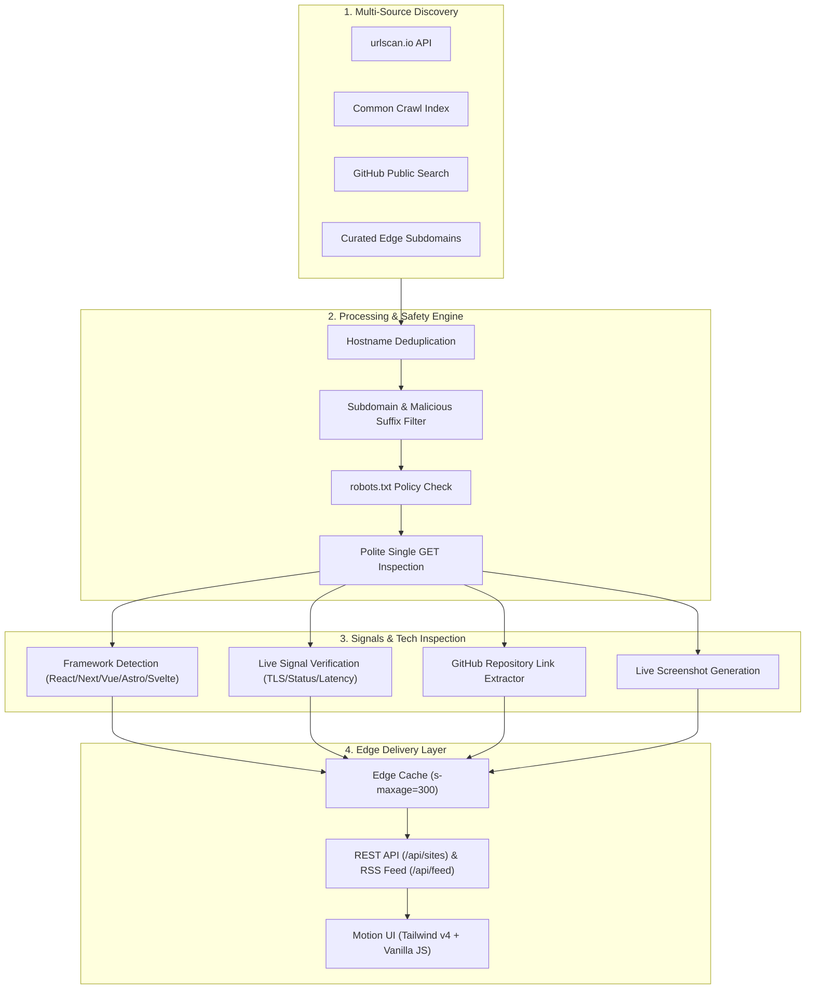

> [!NOTE]
> **Live Web Directory:** SiteScout is live and deployed at **[https://sitescout-app.vercel.app](https://sitescout-app.vercel.app)** — indexing real-time public web applications across 12+ cloud platforms with zero database overhead.

# SiteScout

### Autonomous, stateless visual radar & directory for publicly discoverable web apps.

  <strong>SiteScout</strong> discovers, audits, scores, and visualizes live web applications deployed on free and test hosting domains like <code>vercel.app</code>, <code>pages.dev</code>, <code>netlify.app</code>, <code>github.io</code>, <code>onrender.com</code>, <code>fly.dev</code>, and <code>railway.app</code>.

---

<a href="https://sitescout-app.vercel.app"><strong>Explore Live Directory ↗</strong></a>&nbsp;&nbsp;&nbsp;&nbsp;&nbsp;&nbsp;<a href="https://github.com/sponsors/jojin1709"><strong>Sponsor Project 💖</strong></a>&nbsp;&nbsp;&nbsp;&nbsp;&nbsp;&nbsp;<a href="https://github.com/jojin1709/SiteScout/issues"><strong>Report Issue / Request Source ↗</strong></a>

---

> [!TIP]
> **100% Stateless by Design:** SiteScout operates without a central database. Feeds are generated from multi-source adapters, analyzed at runtime, and cached on the edge (5-minute `s-maxage`) for instantaneous global delivery.

---

## Table of Contents

- [What is SiteScout?](#what-is-sitescout)
  - [Why SiteScout Exists](#why-sitescout-exists)
  - [Key Architecture Principles](#key-architecture-principles)
- [Architecture & Engine Workflow](#architecture--engine-workflow)
- [Supported Hosting Platforms](#supported-hosting-platforms)
- [Automated 100-Point Scoring Engine](#automated-100-point-scoring-engine)
- [API Reference](#api-reference)
- [Security & Safe Crawling Model](#security--safe-crawling-model)
- [Developer & Sponsorship](#developer--sponsorship)
- [Common Questions (FAQ)](#common-questions-faq)
- [License](#license)

---

## What is SiteScout?

Thousands of developers deploy indie projects, open-source demos, AI utilities, and portfolio experiments to subdomains on free cloud platforms daily. Most of these projects never get indexed by traditional search engines and remain hidden.

**SiteScout** is a lightweight, screenshot-first directory that surfaces these applications through safe public discovery, automated Lighthouse-style technical scoring, and framework fingerprinting.

<strong>Why SiteScout Exists</strong>

Traditional search engines index for commercial SEO, favoring large websites with backlinks. Developers looking for inspiration, indie hackers discovering new tools, or security engineers exploring public subdomains had no dedicated visual radar. 

SiteScout acts as a public discovery layer tailored specifically for subdomains on modern cloud providers.

<strong>Key Architecture Principles</strong>

- **No Database Lock-in:** No SQL, NoSQL, or external state stores. It runs effortlessly in serverless memory.
- **Strictly Polite Crawling:** Always checks `robots.txt`, respects 7-second fetch limits, never follows cross-origin redirect traps, and makes at most one homepage request per candidate.
- **Privacy & Simplicity:** No user accounts, tracking cookies, login forms, or user data storage.
- **Dual-Runtime Support:** Codebase runs identically on **Vercel Serverless Functions** (Node.js) and **Cloudflare Pages/Workers** (V8 isolate Edge).

---

## Key Features & Capabilities

- 🛰️ **Automated Hourly Radar Discovery:** Continuous multi-source crawler via GitHub Actions indexing fresh live deployments every hour.
- 📊 **Live Tech Stack Adoption Trends:** Real-time visual breakdown of frameworks deployed across edge platforms (Next.js, React, Astro, Vue, Svelte, Vite).
- 🔗 **Direct GitHub Repository Linkage:** Automatic detection and 1-click links to the open-source GitHub repositories behind deployed apps.
- 📥 **1-Click Dataset Export:** Instant JSON and CSV export of all indexed live deployment records and technical specs.
- 📡 **RSS 2.0 XML Feed:** Subscribe via any RSS reader to receive updates on newly discovered edge deployments (`/api/feed`).
- 🔬 **Interactive Live Sandbox & Modal:** Test live apps in an isolated sandbox iframe or inspect live screenshot captures, response times, and HTTPS signals.
- ⚡ **Tailwind CSS v4 & Motion UI:** Electric sapphire & ice cyan glassmorphic aesthetic with scroll-reveal animations and 3D card tilt physics.

---

## Architecture & Engine Workflow

---

## Supported Hosting Platforms

SiteScout monitors and categorizes subdomains across 12 primary cloud and edge hosting providers:

| Platform | Domain Suffixes | Platform Type | Default SSL |
| :--- | :--- | :--- | :--- |
| **▲ Vercel** | `*.vercel.app` | Serverless & Edge Frontend | TLS 1.3 |
| **⚡ Cloudflare Pages** | `*.pages.dev` | Global Edge Network | TLS 1.3 |
| **⛅ Cloudflare Workers** | `*.workers.dev` | Edge Compute Functions | TLS 1.3 |
| **💎 Netlify** | `*.netlify.app` | Jamstack & Serverless | TLS 1.3 |
| **🐙 GitHub Pages** | `*.github.io` | Static Documentation & Sites | TLS 1.3 |
| **🚀 Render** | `*.onrender.com` | Cloud Application Platform | TLS 1.3 |
| **🎈 Fly.io** | `*.fly.dev` | Global Micro-VM Containers | TLS 1.3 |
| **🚂 Railway** | `*.railway.app` | Infrastructure Platform | TLS 1.3 |
| **🔥 Firebase Hosting** | `*.web.app`, `*.firebaseapp.com` | Google Cloud Static & Dynamic | TLS 1.3 |
| **🌊 Surge** | `*.surge.sh` | Static Web Publishing | TLS 1.3 |
| **🟣 Heroku** | `*.herokuapp.com` | Cloud Container Platform | TLS 1.3 |
| **♾️ InfinityFree** | `*.epizy.com`, `*.rf.gd`, `*.42web.io`, `*.infinityfreeapp.com` | Free Cloud & PHP Hosting | TLS 1.3 |

---

## Real-Time Technical Signals & Verification

Each discovered website is evaluated against real-time production signals:

| Signal | Verification Standard | Impact |
| :--- | :--- | :--- |
| 🔒 **HTTPS Enforcement** | Strict TLS 1.3 / TLS 1.2 encrypted transport | Security |
| 🌐 **HTTP Status Verification** | Verified `200 OK` response without loops | Reliability |
| ⚡ **Response Latency** | Direct millisecond response time measurement | Performance |
| 🏷️ **SEO & Social Meta** | Standard HTML `<title>`, `<meta description>`, and OpenGraph | Discoverability |
| 📱 **Mobile Viewport** | Dynamic responsive mobile viewport declaration | User Experience |
| 🛡️ **Security Headers** | Presence of HSTS, CSP, and X-Content-Type-Options | Defense |

---

## API Reference

SiteScout exposes clean, CORS-enabled JSON and RSS API endpoints:

| Endpoint | Method | Description | Cache Policy |
| :--- | :--- | :--- | :--- |
| `/api/sites` | `GET` | Paginated discovery feed with filtering & sorting | `public, s-maxage=300` |
| `/api/site?host={hostname}` | `GET` | Detailed technical signals & specs for a site | `public, s-maxage=300` |
| `/api/feed` | `GET` | RSS 2.0 XML feed of recent live deployments | `public, s-maxage=300` |
| `/api/random` | `GET` | Returns a random discovered live website | `public, s-maxage=60` |
| `/api/health` | `GET` | Service status, runtime verification & timestamp | `no-store` |
| `/api/cron/collect` | `POST/GET` | Authenticated trigger to refresh live discovery feeds | `no-store` (Protected) |

---

## Security & Safe Crawling Model

SiteScout enforces strict security and crawling policies:

1. **HTTPS-Only:** Rejects unencrypted HTTP URLs.
2. **Subdomain-Only Rule:** Only inspects valid subdomains on allowed developer cloud platforms; apex domains and generic root URLs are rejected.
3. **Robots.txt Adherence:** Fetches `/robots.txt` before any candidate homepage request and honors disallow rules for `SiteScoutBot` / `*`.
4. **No Cross-Origin Traversal:** External redirects to unrelated domains are dropped immediately.
5. **Payload Limiting:** Restricts inspection body payloads to < 2MB with a strict 7000ms timeout.

---

## Developer & Sponsorship

Developed with ❤️ by **JOJIN JOHN** ([@jojin1709](https://github.com/jojin1709)).

- 🌐 GitHub: **[github.com/jojin1709](https://github.com/jojin1709)**
- 💖 Sponsor: **[Support via GitHub Sponsors](https://github.com/sponsors/jojin1709)**
- 💼 Security Research, Full-Stack Development & Ethical Hacking

If SiteScout is useful for your research, discovery, or side project exploration, please consider starring the repository ⭐ and supporting development!

---

## Common Questions (FAQ)

### Does SiteScout require a database?
No. SiteScout is completely stateless. It collects candidates into an in-process cache, inspects them on the fly, and edge-caches responses via CDN headers (`s-maxage=300`).

### How are frameworks detected?
SiteScout inspects HTML markers, meta tags, and script bundle patterns for signatures corresponding to Next.js, React, Vue, Nuxt, Svelte, Angular, Astro, Vite, and WordPress.

---

## License

This project is licensed under the **[MIT License](LICENSE)** &copy; 2026 **JOJIN JOHN**.

  Built with precision by <strong>JOJIN JOHN</strong>.

